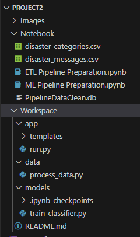
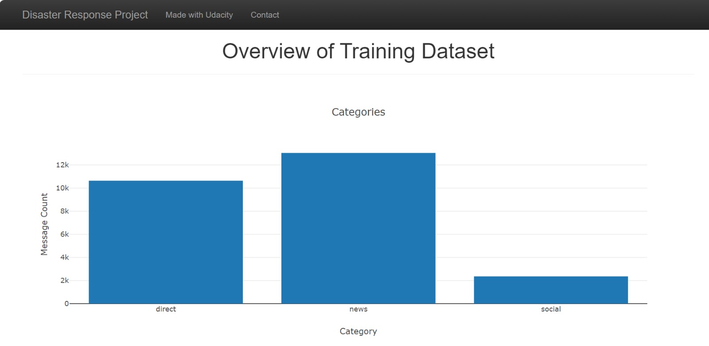
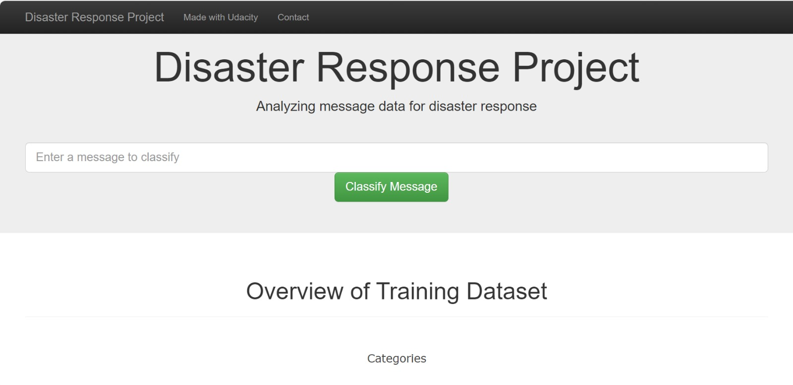
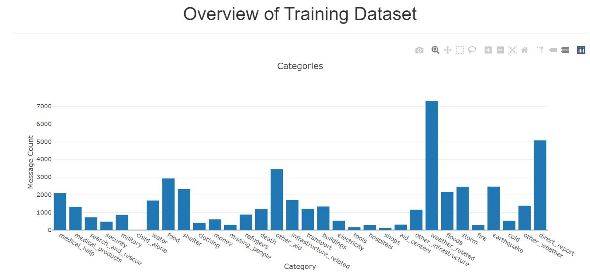
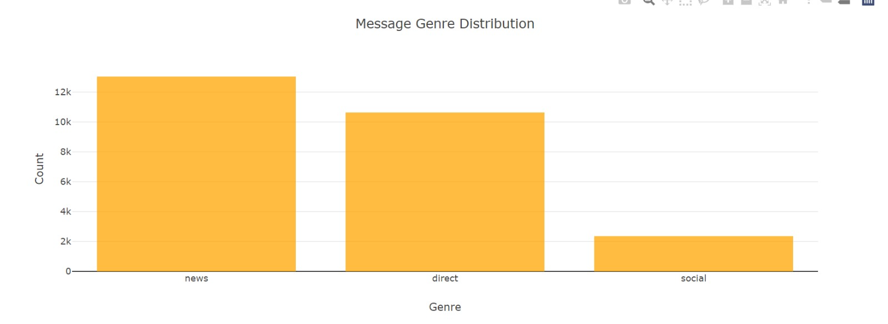

# Disaster Response Pipeline Project
 

For further insights into this project, including all associated files and code components, kindly access the project repository by clicking the provided link.
### Introduction Summary

In this project, I engaged with a dataset generously supplied by UDacity, leveraging it to construct a multifaceted system comprising Extract, Transform, Load (ETL), Natural Language Processing (NLP), and machine learning pipelines. The primary goal was to effectively categorise emergency service messages received from users, contextualizing them based on the specific needs expressed in response to a natural disaster event. The textual inputs, often referred to as the "voice of the victim," served as the foundation for this classification process.

I further integrated the Flask framework, developing a user-friendly interface that can be seamlessly deployed via web platforms. This approach ensures accessibility and ease of use for stakeholders interacting with the system, facilitating efficient and informed decision-making in emergency response scenarios.

Project Structure
1. ETL Pipeline process_data.py prepares the script that performs the data cleaning pipeline in the sequence below
Loading the file paths of messages.csv and categories.csv
Cleans, removes duplicates and merges the 2 datasets into one final dataset
Saves the data-frame to a SQLite database

2. ML Pipeline train_classifier is the script used to create the model and below are the steps taken to produce the model
Loads the data from the SQL database which was saved from the ETL pipeline
apply Tokenizing,classification to prepare the model
revoke the gridsearch to opmitise the parameters and recommnend best parameters
Archive the model to a pickle file , to import onto the flask app

3. Flask Webb App run.py allows the user:

To take an input from user, process by classifying add issue the related message and help needed, linking it to related categories from the total of 36.

Visualise the saved messages rendered from the database called PipelineDataClean.db

## File Structure and Folders

images Folder
- Screenshots of images as examples of Output

Notebook
- ETL Pipeline notebook for ETL, output will be process file
- ML Pipeline jupyter notebook for Machine Learning, preparing Tmodel pkl file
- disaster_messages.csv : csv file that contains difderent messages
- disaster_categories.csv : csv file that cotains different categories
- Cleaned database named PipelineDataclean, an SQL database created 

app
-  inside templates we running go.html and master.html
- run.py : A Flask app that will highlight message category as given by user
- go.html and master.html : for visualisations in app

data
- process.py : a script for ETL

Models
- train_classier.py : a populated script for ML
- Default file we found inhere called ipynb_checkpoints

README.md
- this file

### Instructions on Running the App 

ETL Pipeline: 
when you open the data folder in your IDE, you need to add the below commands in terminal of process_data.py
process_data.py disaster_messages.csv PipelieDataClean.db
ML Pipeline
when you open the models folder in your IDE, you need to add the below commands in terminal of train_classifier.py
train_classifier.py PipelieDataClean.db classifier.pkl

Results
To run the app you need to open Workspace folder in your IDE application(vs code) and run the run.py file.

Below is the output of the application using plotly to render the visuals sorted from highest to lowest count by source and category.

The classification example when you add a message on app

### Acknowledgement

i hereby acknowledge that the dataset used is for learning purposes and was acquired from Udacity in order to complete the assignment.